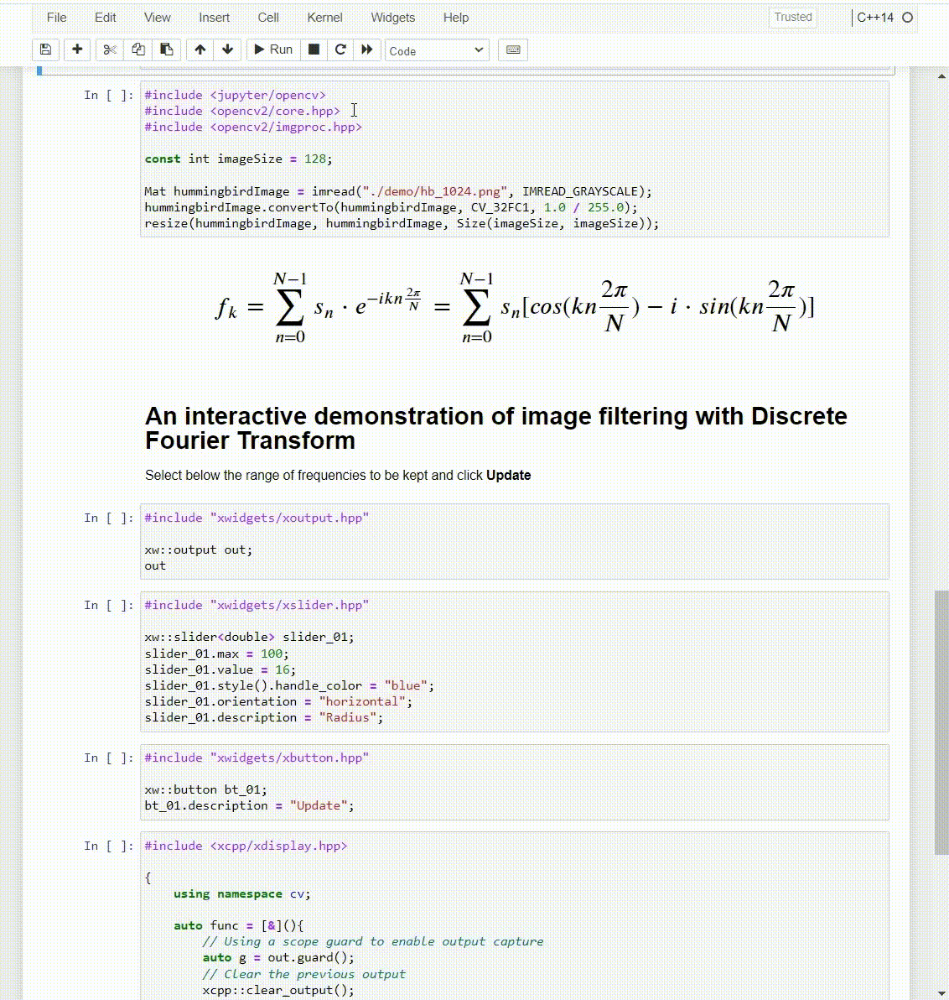

    <h1 itemprop="headline">docker-xeus-cling-opencv-xwidgets</h1>

  

A docker image with a preinstalled set of libraries, frameworks and applications with an emphasis on **Computer Vision** and **Machine Learning** specifically in **C++**.
The common use cases are research and experimenting, creating tutorials and presentations.

## Key features
It allows for the use of **OpenCV 4.5.5** from C++ inside the Jupyter notebook. The UI components from **xwidgets**, help the creation of even more interactive experience.

### List of the more important components
 - Jupyter Notebook/Lab
 - Miniconda
 - OpenCV 4.5.5
 - Xeus-Cling
 - xwidgets
 
 
## Installation

 - **Using directly the pre-built Docker image**
   - Install docker
   - docker run -it -v &lt;Local directory to be mounted as a workspace&gt;:/workspace -w /workspace -p 8888:8888 ssarnev/xeus-cling-opencv-xwidgets:opencv_4_5_5 /bin/bash
   - jupyter notebook --allow-root --ip=0.0.0.0 --port=8888
 - **Building the image locally**
   - Install docker
   - Open Git Bash
   - git clone https://github.com/ssarnev/docker-xeus-cling-opencv-xwidgets.git &lt;directory of your choice&gt;
   - cd &lt;directory of your choice&gt;/docker-xeus-cling-opencv-xwidgets
   - bash build_in_3_steps.sh
   - docker run -it -v &lt;Local directory to be mounted as a workspace&gt;:/workspace -w /workspace -p 8888:8888 ssarnev/xeus-cling-opencv-xwidgets:opencv_4_5_5 /bin/bash
   - jupyter notebook --allow-root --ip=0.0.0.0 --port=8888   
    
 
## Acknowledgement
 Inspired and based on the following
  - https://github.com/Seachaos/docker-python-xeus-cling
  - https://github.com/Seachaos/opencv-cpp-for-xeus-cling
  - https://github.com/czeni/opencv-video-minimal

## References
  - [Xeus-Cling: Run C++ code in Jupyter Notebook, Vishwesh Shrimali, LearnOpenCV](https://learnopencv.com/xeus-cling-run-c-code-in-jupyter-notebook/)
  - [Miniconda](https://docs.conda.io/en/latest/miniconda.html)
  - [Jupyter Notebook](https://jupyter.org/)
  - [Xeus-Cling](https://github.com/jupyter-xeus/xeus-cling)
  - [Cling](https://github.com/root-project/cling)
  - [xwidgets](https://xwidgets.readthedocs.io/en/latest/)

## License
Licensed under MIT license, see LICENSE file.
